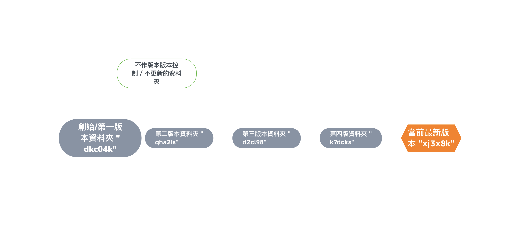
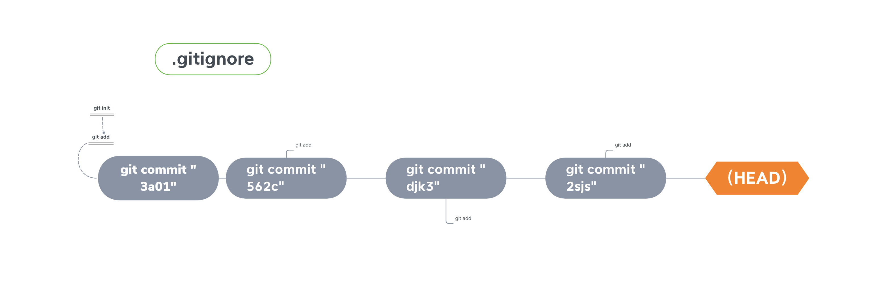

## 跟你朋友介紹 Git

## Git 是什麼

可以**進行版本控制的程式**。其管理概念上跟**利用不同資料夾分隔出版本**的方式是差不多的。

在**資料夾名稱皆以不重複亂數的命名前提下**，建立了第一份的資料夾之後，<u>再複製建立的資料夾就等同一個新的版本</u>，並可以從該版本進行更動。對於不會更新或者沒需要作版本控制的部分時，就獨自匯集在一個特定的資料夾即可。而**最新的版本的資料就會以<u>檔案格式</u>的形式存在**，直到又有更新的版本，再改存放在自己一個版本的資料夾中便可。

用圖片表示的話，整體看起來就像這樣：

那麼這裡再置換成 Git 的話：

## 安裝 Git

如果是**Windows**系統，但**已經安裝 [Git-Bash](https://gitforwindows.org/)** 的話，裡面就**已經包含 Git **的部分了，可以不用再另外安裝。

如果是用 **MacOS**，然後**版本是10.9以上**（你可以點選左上角落的蘋果圖案從「關於這台Mac...」來確認），你可以打開命令列介面中直接輸入`git --version`，如果電腦上沒有安裝，這裡會<u>自動引導你安裝 Git</u>。這裡還有一種情況是，輸入`git --version`時回傳`git version X.X.X.X (Apple Git-XX)`，這是 Mac本身內建的 Git。你可以直接安裝官網提供的 Git，並**重新開啟命令列介面**，就會自動改用新安裝的 Git 版本了（用同一個指令檢查時，不會出現 "Apple Git" 的字眼）。

如果都不符合上述情況，請安裝 [Git](https://www.notion.so/Week1-a6369a11f8044667be333679705b651e#0a80e88fd96b4da5b23eb1f9f442b6b7)。這裡就如平常你安裝軟體的方式一樣，照著步驟安裝即可。

## 如何用 Git 進行版本控制

##### 一行流程：

`cd 想要進行版本控制的資料夾` → `git init` → `touch .gitignore` → `git add .` → `git commit -m '說明描述'`

##### 步驟解說： 

0. 打開命令列介面，**<u>一定要先到你想用 Git 來進行版本控制的資料夾中</u>**。

1. **`git init`**

   **Git 專案初始化**。表示<u>開始使用 Git 進行版本控制</u>，也是非常重要的起手式。

2. **`touch .gitignore`**

   **建立名為 gitignore 隱藏檔案**。在 Git 中會被視為一個特別的檔案，可以把它想成是一個<u>忽略名單</u>，只要把不想要 Git 追蹤的檔案跟資料夾的名稱寫進檔案中即可。

3. **`git add 檔案名稱`**

   **將檔案或資料夾加入版本控制中**。如果想將<u>所有東西一次加入 Git 的版本控制</u>裡，可以寫成 **`git add .`**。

4. **`git commit -m "說明"`**

   **建立版本紀錄**。這可以想成是<u>在一條時間軸上的建立存取點</u>（或像在一條路上設置路標），如果日後需要的話，就可以恢復到這個版本來做修改。 `-m "說明"` 就是寫一些簡單的說明描述，也方便往後檢視可以了解這個版本做了哪些事情。
   
   若是<u>之前已經加入 Git 版本控制中</u>的檔案，可以省略 "add" 的步驟，直接輸入 `git commit -am "說明"` 。再次強調**只限已經加入 Git **的檔案和資料夾！如果是途中新增的檔案或資料夾，<u>必須要經過 `git add`</u> 才會含納在 Git 版本控制當中。

以上，便是 Git 版本控制的基本步驟。除了 `git init` 和 `touch .gitignore` 之外，會持續用到的操作主要是 `add` 以及 `commit`。

另外，也可以藉著以下這些指令來**確認整個版本控制的狀況**：

- **`git log`**

  **查看過去所有版本的資訊**。跳出瀏覽畫面的話，按 q 鍵即可以離開。當中出現<u>亂數般的字串</u>便是**該版本的 ID**，如果以後有恢復到某個版本的需求時，就會需要這個 ID。

  若覺得資訊太煩雜，可以在後面加上 `--oneline`，就會顯示比較精簡的訊息。

- **`git status`**

  **顯示 Git 版本控制中或在外的檔案及資料夾的狀態**。沒有被加入 Git 的資料會列入" Untracked "（未追蹤），而已經加入控制中而有所變動的部分則為顯示 " Modified "（修改）。

至於在<u>保留一個原來版本的同時又能有其他複本來修改</u>的情況，可以藉著**建立分支**（branch）來達成：

1. **`git branch 分支名稱`**

   **建立分支**。除此之外，加上`-v` 可以<u>查看既存的分支</u>，`-d 分支名稱`則可<u>除該分支</u>。<u>更改現在使用的分支名稱</u>可用`git branch -m 新分支名稱`。

2. **`git checkout 分支名稱`**

   **切換到該分支**。如果將 `分支名稱` 換成 `版本 ID` 的話，就可以**切換到該版本的狀態查看**。要注意的是，這<u>並非真的恢復到該版本</u>（也就是這之後先前所做的紀錄都還在），所以想回到最新的狀態的話，直接切換到 `master` 分支（或是當初所在的分支名稱）即可回到最新的狀態。

   `git checkout -- 檔案名稱` 則可以使<u>該檔案恢復到更動前的狀態</u>（尚未 `commit` 的情況下）。

3. **`git merge 分支名稱`**

   **將該分支併入初始的分支上**。初始的分支就是在<u>執行 `git init` 後自動產生的第一個分支</u>，通常自動命名為 `main` 或 `master`。

其他對應的狀況：

- **`git commit --amend`**

  **修正<u>剛剛 commit</u> 的說明內容**。

- **`git reset HEAD^`**

  **恢復到上一個版本的狀態**。`HEAD^`代表是恢復到最新版本之前、意即上一個版本的狀態。`HEAD^`又可以用`版本 ID` 置換，表示**恢復到該版本的狀態**。

  後面可以選擇使用`--mixed`、`--soft` 或 `--hard`。這是**指定該版本中檔案跟資料夾恢復的程度**。

  `--mixed` 是預設值，除了<u>移除 commit 以及從版本控制名單踢掉新增的部分</u>外，已經 add 的檔案跟資料夾的內容則不變。

  `--soft` <u>僅移除 commit</u>，內容不會有變動。

  `--hard` 則是**<u>完全移除 commit 及其內容</u>**，也就是上一個版本剛 commit 完成時的狀態。

- **`git diff 檔案名稱`**

  **顯示該檔案有哪些變動跟差異**。

## 進階應用 Git：與 GitHub 的推拉同步術

### GitHub是什麼？

它是一個<u>可以放置作品並分享、甚至能讓別人一起參與作品改良的線上倉庫</u>。由於是 Git-Based的視覺平台，所以只要會 Git 指令就可以操作了。

### 使用 GitHub

首先，請先去 [GitHub](https://github.com) 申請帳號。如果已經有的話請直接登入吧！

1. 登入完進入頁面後，請點選**右上方「+」的圖案**（在帳號頭像隔壁），然後按**「new repository」**來新增一個 repository。把最必要的 repository 名稱填完送出，就會直接來到新增的 repository 的頁面了！

2. 在 repository 的頁面中，有幾個貼心提示說明要怎麼把你的作品「推」到 GitHub 上。請參考<u>最下面的針對已經新增 repository 的說明區塊</u>。只要依照當中的順序，把指令一一執行在電腦的命令列介面中（記得要先 `cd` 到想要推的資料夾中），就可以把資料上傳到 GitHub 上了！ 這裡就來簡單說明每一行指令代表的意義：

     3. **`git remote add origin 你的repository網址`**

        先指定遠端是哪個 repository（即那條網址），並以 origin 作為 repository 的代稱。

     2. **`git branch -M main`**

        將本地的初始分支從 master 重新命名為 main。雖然過往都是預設為 master，不過近期被判斷是帶有歧視性的字詞，因此在 [2020 年 10 月](https://www.ithome.com.tw/news/140094)之後一率改成 main 。

        其實就單純只是換了名字而已，本質沒有改變。

     3. **`git push -u origin main`**

        **在完成 commit 之後**，最後將本地的分支 main 推到 GitHub 的指定 repository 上。`-u` 就是設定要把東西推到哪裡的意思。這一部分以後是可以省略不寫。

     4. **`git pull origin main`**

        這是當在 GitHub 上進行更動之後，可以從藉著 CLI 把上面更新的部分「拉」到自己的電腦中，也就把你自己電腦裡的作品也做了一樣的更新。用比較術語的方式來說，就是把 GitHub 的改變用<u>人工的方式</u>**同步**到你的電腦中。反過來說，你也可以把你電腦中所做的更動同步到 GitHub 上，也就是執行 `push`指令的部分。

  只要記得，**推Hub**，**拉Git**，就表示哪邊被同步。

---

### 快速導覽表

| 步驟或關聯 |                  指令                  |         常搭配使用的選擇性指令          |                             說明                             |
| :--------: | :------------------------------------: | :-------------------------------------: | :----------------------------------------------------------: |
|     1      |               `git init`               |                                         |             啟動 Git 版本控制，版本控制初始化。              |
|     2      |           `touch .gitignore`           |                                         | 用來免除版本控制的忽略名單。將檔案名稱或資料夾名稱寫入檔案中即可。 |
|     3      |       `git add 檔案或資料夾名稱`       |                   `.`                   | 將異動或新增的檔案和資料夾加入版本控制中。`.`可以一次加入所有的檔案和資料夾。 |
|     4      |         `git commit -m "說明"`         |            `-am`、`--amend`             | 建立版本。`-m`是用來簡短說明該版本的變動。`-m`可以替換成`-am`，表示一併完成 add 的步驟並 commit。**`-am` 只限於已經加入過的檔案和資料夾**。 `--amend`則是可以修改最後 commit 的說明。 |
|     -      |               `git log`                |               `--oneline`               | 查看版本紀錄，包含版本的 ID 。`--oneline`則顯示較精簡的資訊。 |
|     -      |              `git status`              |                                         | 檔案和資料夾的版本控制狀態。尚未加入版本控制的狀態為 " Untracked "，已經加入但有變動的狀態是 " Modified "。**不會顯示被加入.gitignore的東西**。 |
|     -      |          `git diff 檔案名稱`           |                                         |               可以查看該檔案的內容有哪先變動。               |
|     -      |         `git branch 分支名稱`          |  `-v`、`-d 分支名稱`、`-m 新分支名稱`   | 建立分支。`-v`可以查看有哪些分支，`-d`是刪除所選的分支，`-m`則是重新命名該分支。 |
|     -      |        `git checkout 分支名稱`         |         `版本ID`、`-- 檔案名稱`         | 切換分支。如果換成版本 ID，則可以回到該版本的狀態查看。若使用`-- 檔案名稱`，則會恢復該檔案上一次儲存前的狀態。**僅限尚未 commit 之前**。 |
|     -      |          `git merge 分支名稱`          |                                         |        將分支合併於初始分支，也就是 master 或 main 。        |
|     -      |           `git reset HEAD^`            | `版本ID`；`--soft`、`--hard`、`--mixed` | 重置成指定版本的狀態。`HEAD^`表示是回到當前所在（HEAD）的前一個版本建立的時間點，這邊也可以換成版本的 ID。`--soft`、`--hard`、`--mixed`則是針對該版本中檔案與資料夾的恢復狀態。`--soft`僅移除 commit 而當前內容及新增資料不變，`--hard`是完全移除 commit 以及當前內容；最後`--mixed`則是移除 commit 、保留已經更動的內容，但未加入新增的資料，亦是未指定時的預設值。 |
|   GitHub   | `git remote add origin 你的repository網址` |                                         |     設定遠端要同步的 repository，並設置 origin 為代號。      |
|   GitHub   |          `git branch -M main`          |                                         |              重新命名本地端的初始分支為 main。               |
|   GitHub   |   `git push -u origin 本地分支名稱`    |                                         | 將本地端的分支同步推到 GitHub 以 origin 為代表的 repository 上。 `-u`為指定推到哪個地方，以後可以省略不寫。 |
|   GitHub   |         `git pull origin main`         |                                         |        把遠端 GitHub 的資料同步拉到本地端初始分支上。        |